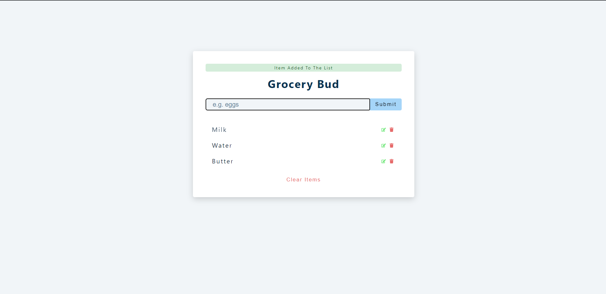

# grocery-bud
Saves content in browser localstorage
<h1 align="center">GroceryBud</h1>

## Table of Contents

- [Description](#description)
- [Features](#features)
- [Installation](#installation)
- [Usage](#usage)
- [Contributing](#contributing)
- [License](#license)

## Description

GroceryBud is a simple web application that helps you save your grocery list and manage your shopping. With GroceryBud, you can easily add items to your list, mark them as purchased, and remove them when you're done. The application saves your grocery list to your browser's local storage, so you can access it anytime, even when you're offline.

## Features

- Add items to your grocery list
- Mark items as purchased
- Remove items from your list
- Save your list to your browser's local storage
- Access your list anytime, even when you're offline

## Installation

To install GroceryBud, follow these steps:

1. Clone this repository: 'https://github.com/Chaitanya-gandhi-41/grocery-bud.git'
2. Navigate to the project directory: `cd grocerybud`
3. Install the dependencies: `npm install`

## Usage

To use GroceryBud, simply open the `index.html` file in your browser. You can add items to your grocery list by typing them in the input field and pressing the `Enter` key or clicking the `Add Item` button. To mark an item as purchased, click the `Check` button next to it. To remove an item from your list, click the `Remove` button next to it. Your grocery list will be saved to your browser's local storage, so you can access it anytime, even when you're offline.

## Contributing

If you'd like to contribute to GroceryBud, feel free to fork this repository and submit a pull request.

## License

GroceryBud is licensed under the MIT License.

## Live Site

Visit the live site here: https://aaeb-grocery-bud.netlify.app/
